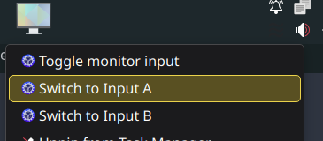
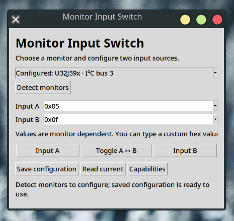

# Monitor Input Switch

Linux GUI, CLI and desktop launcher for switching one selected external monitor between two inputs via DDC/CI. Python standard library + Tk; no pip dependencies. Works on KDE/GNOME, including Wayland, because control goes through I²C rather than the window system. This is a native Linux tool, not a WSL monitor-control tool.

## Install

Arch / CachyOS:

```bash
sudo pacman -S ddcutil python tk
```

Debian / Ubuntu:

```bash
sudo apt install ddcutil python3 python3-tk
```

Fedora:

```bash
sudo dnf install ddcutil python3 python3-tkinter
```

Extract this package, enter its directory, then:

```bash
bash install.sh
~/.local/bin/ddc-input-switch
```

The installer installs for your user only. It creates an application-menu entry with right-click actions for Toggle, Input A and Input B. No sudo is used by the tool or installer. A desktop action runs without a terminal; use the GUI or CLI for error details.


  

## Configure

1. Enable DDC/CI in the monitor's on-screen menu.
2. Click **Detect monitors**, then select your monitor.
3. Click **Capabilities**. Look for feature `60` (Input Source) and its supported values.
4. Select two inputs, or type their custom hexadecimal values. Click **Save configuration**.
5. Click **Read current** to confirm communication. Use **Input A**, **Input B**, or **Toggle A ↔ B**.

Common MCCS values are DisplayPort 1 = `0x0f`, DisplayPort 2 = `0x10`, HDMI 1 = `0x11`, HDMI 2 = `0x12`. Monitor firmware can use other values or advertise incomplete capabilities. Use your monitor's reported/observed values; the tool does not assume which physical cable corresponds to A or B.

Configuration: `$XDG_CONFIG_HOME/ddc-input-switch/config.json` (normally `~/.config/ddc-input-switch/config.json`). A monitor with a manufacturer, model and ASCII serial is selected by those identifiers; they must uniquely identify it. Without those identifiers, selection uses its I²C bus, which can change after reconnecting or rebooting. Detect and save again if that happens. USB DDC monitors are not listed by this version.

The GUI switches the current selection with its current A/B fields. Save to make those choices available to CLI and desktop actions. Buttons are disabled while DDC commands are running; the GUI remains responsive.




## CLI and KDE shortcuts

```bash
~/.local/bin/ddc-input-switch detect
~/.local/bin/ddc-input-switch current
~/.local/bin/ddc-input-switch a
~/.local/bin/ddc-input-switch b
~/.local/bin/ddc-input-switch toggle
~/.local/bin/ddc-input-switch capabilities
```

In KDE System Settings → Keyboard → Shortcuts, add a command using the full path `/home/YOUR_USER/.local/bin/ddc-input-switch toggle` and assign a key combination. You can also pin the application launcher to your panel. For predictable one-way switching, create separate shortcuts for `a` and `b`.

An explicit bus override bypasses saved monitor identity:

```bash
~/.local/bin/ddc-input-switch toggle --bus 7 --input-a 0x0f --input-b 0x11
```

Toggle reads VCP `60` first and switches only when the result matches A or B. Unknown inputs and read failures produce an error; no cached state is used. Explicit A/B commands do not require reading the current input. Successful writes report that the request was sent, not that the display visibly switched. Input changes can make verification impossible.

## Switching back and limitations

Some monitors accept DDC from inactive inputs; others do not. A switch can therefore disconnect DDC access from the computer that sent it. This tool cannot bypass that firmware behavior. Install/configure it on the other Linux computer as well, or use that computer's DDC software or the monitor buttons to return. A/B represent physical inputs; keep their assignments consistent on both computers if you want the same labels.

DDC changes the video input, not a separate keyboard/mouse USB switch. A monitor's integrated KVM may follow video input if configured in its menu. Laptop internal panels generally do not support this feature. Docks, adapters and cables can block DDC.

## Troubleshooting

Run `ddcutil detect` as your normal user. If there are no I²C devices, try:

```bash
sudo modprobe i2c-dev
```

If needed, make loading persistent:

```bash
printf 'i2c-dev\n' | sudo tee /etc/modules-load.d/i2c-dev.conf
```

Current ddcutil packages normally install udev rules granting the active local user access to video-controller I²C devices. If you receive permission errors, check your distro's ddcutil package/rules and the upstream permissions documentation; do not make all I²C devices world-writable. Do not run the GUI as root.

Manual diagnosis:

```bash
ddcutil detect
ddcutil --bus 7 capabilities
ddcutil --bus 7 getvcp 60 --terse
ddcutil --bus 7 setvcp 60 0x11 --noverify
```

Commands have a 45-second timeout. GUI errors include ddcutil's output. Closing the window during a command does not undo a switch already sent; an active subprocess may finish before the Python process exits.

Uninstall: remove `~/.local/bin/ddc-input-switch`, the `ddc-input-switch` directory under your XDG data directory, and `applications/ddc-input-switch.desktop` under that directory. Remove the configuration directory separately if desired.

## Validation and references

Run `python3 -m unittest discover -s tests -v` from this directory. Tests use a fake ddcutil process to exercise parsing, exact write arguments, toggle direction, and read/error handling. No physical monitor was available for hardware verification.

Official documentation used:

- https://www.ddcutil.com/command_getvcp/
- https://www.ddcutil.com/command_setvcp/
- https://www.ddcutil.com/display_selection/
- https://www.ddcutil.com/i2c_permissions/
